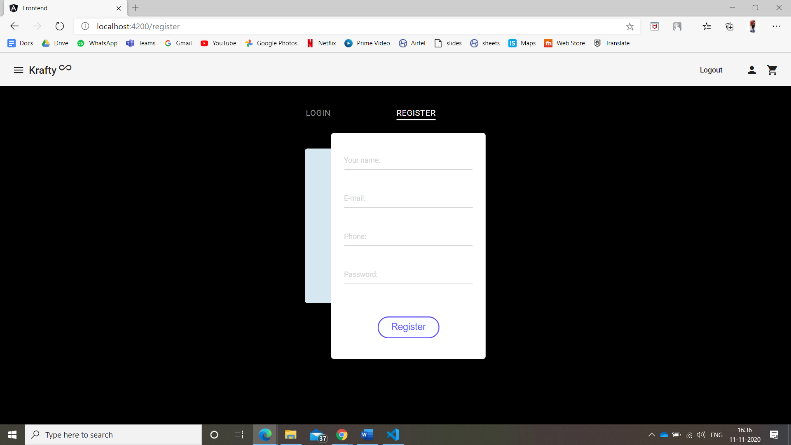
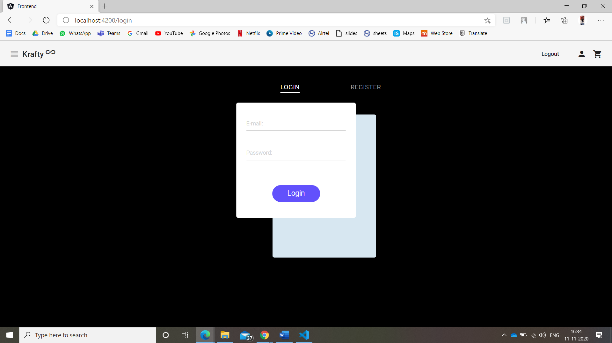
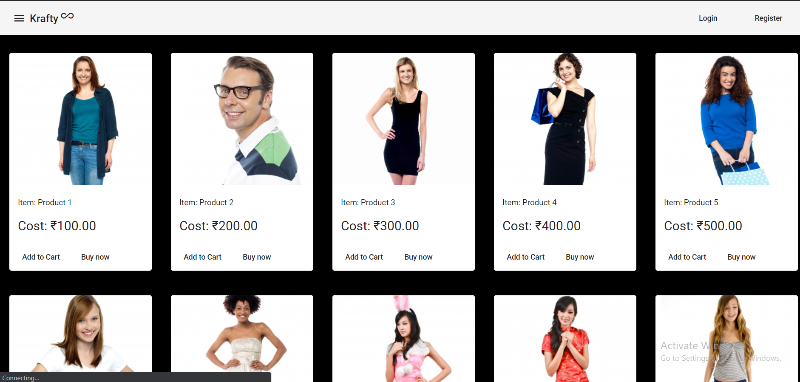
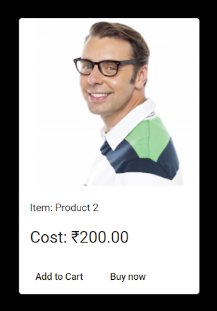

# Krafty
## Experience the lifestyle  

<h3><b><u>Introduction</h3></b></u>
We all love doing shopping. This pandemic has made it difficult to go to a mall and shop. But no matter what, the style must go on and we respect that. So here we are, the best fashion centric e-commerce website with variety of choices. You choose from the best of the products and we deliver it to you, fast and safe right at your doorstep.   

<h3><b><u>Problem Statement</h3></b></u>
<li>The covid-19 pandemic has impacted the fashion industry. Their sales have dropped as malls are closed and people don't trust the authenticity of the other online sales.
<li> Most of the e-commerce applications either try to show you a lot of advertisements after you see their products or track your data and use it to manipulate you.
<li> It is diificult for a user to store some products in the wishlist(cart) and buy them later on. 
<li> User interface of the e-commerce apps are complex and a new naive user finds him lost in the website with a lot of buttons to click.  

<h3><b><u>Solution</h3></b></u>
<li> So we come up with our own e-commerce app "Krafty". A simple, elegant website on which you can shop quickly and easily and browse through hundreds of products.
<li> We know that security of your account matters and so we came up with a user-friendly authentication system. Simple to sign up for new users or login for existing user.
<li> Products have simple two options, either add them to cart or buy them right away. An user friendly product display from which a user can select the product.
<li> An updatable cart system, where you can update the quantities of product, remove products or add new products and see changes in the total billing amount in real time.
<li> An easy to checkout option. Before checking out have a complete idea about the breakage of the billing amount, rate and amount of every product, with the shipping charges and tax information.  

<h3><b><u> Key Features </h3></b></u>
<li><b> Authentication</b> 
Krafty has an amazing authentication system where a existing user can login to the same state where he left. Login requires just your email address and the password. New user can sign up with your email, other user information and create a new password through which user can login.

<li><b> Product Display</b> 
Krafty has a user friendly product display system. Every product has perfect sized image of the products along with price of the product. User has an option to add that product into the cart or checkout by buying that single product. News products can be added, product details can be modified or products can be removed very easily.

<li><b> Interactive Cart </b> 
Krafty has a interactive cart. User can change the quantity of the products in cart, remove the products, add new products and see the changes in the amount in real time. Cart saves the state of the user, so refreshing the page, closure of session does not impact the items within cart. User can logout and after logging again he can resume from same state.   

<h3><b><u> Note to the developers :</h3></b></u> 
<h3><b> To run/ Setup on your local system </b></h3>
<li> Clone this git repository using below command:

`git clone https://github.com/JigarJoshi04/EcommerceWithCart`

<li> Change your current directory by using the command:

`cd e-commerce`

<li> You must see two folders named and a readme file

`backend`  
`frontend`  
`readme.md`

<li> Create two sessions of the terminal in the vscode or from the folder "e-commerce" 

<u>Session 1</u>
<ol><li>In session one of the terminal change the current directory to "e-commerce/backend" by using the command :

`cd backend`  
<li>In session one of the terminal execute the following commands one at a time:

`npm install dependencies`  
`node app.js`  

<li> If everything is done perfectly than you must see amessage 

`Connected to db at port 3000`  
this means your database is connected and your backend is ready.</ol>

<u>Session 2</u>
<ol><li>In session two of the terminal change the current directory to "e-commerce/frontend" by using the command :

`cd frontend`  
<li>In session two of the terminal execute the following commands one at a time:

`npm install dependencies`  
`npm start`  </ol>

<h3><b>Tech Stack </b></h3>
<ol>
<li> Mongo DB (Database) </li>
<li> Express (Middleware)</li>
<li> Angular (Frontend)</li>
<li> Node (Server Side Language)</li>
<li> Visual Studio Code (Code Editor)</li>
<li> Github (Version Control) </li>
<li> E-Draw Max (Database Design) </li>
<li> Postman (Testing API)</li>  
</ol>

## Future Scope

<li>In future we an have a admin panel for the admins, mentors, moderators to faciliate the product editing, adding and removing products in a more user friendly way.
<li>Products in future can be divided into various categories like footwears, shoes, shirts, blazer and so on and so forth.
<li>Tracking of order can be introduced to track the status of order and check the delivery status. User can be provided with the estimated time for delivery.
<li>Wishlist can be introduced to stare the products. User can be notified when the products inside his whishlist goes on sale or bumper discount.
<li>Online payment system can be intorduced to get the pre-paid payments from the user supporting multiple fin-tech app.  

## Buisness Model

<li>Our website can either serve as a standalone product selling products fro various brands and we can generate revenue through commission on every order. We can collaborate with various brands and sell the genuine goods from the top notch brands.

<li>Krafty itself can became a brand of clothes. We can either manufacture our own branded goods and sell here. Taking control ofproduction line assures high margin.

<li>We can sell this website to some brand and this website can become a dedicated platform to sell the products from only that brand. This way we won't just limit ourselves to fashion industry and any brand looking for selling products online can be approached and pitched to buy our website.   

<h3><b>Video link for demo</h3></b>

<a href= "https://youtube.com"> Video Link </a>

<h3><b>Screenshots</h3></b>

 
 
 
  
<!-- 

 -->

<h3><b>Made with love from</h3></b>
 
<a href= "https://github.com/anchaljain007/"> Anchal Jain </a> 
<a href= "https://github.com/anshnt/"> Ansh Jain </a> 
<a href= "https://github.com/JigarJoshi04/"> Jigar Joshi </a>

